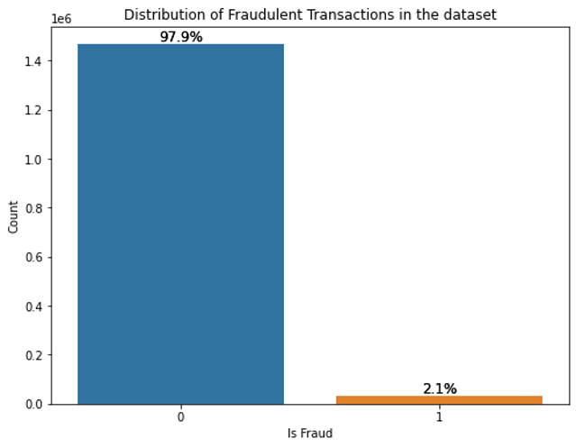

# Introduction:

The essential challenges of fraudulent detection is imbalance dataset and domain related and complicated feature engineering, specific features, such as transaction between two locations (the figure in the following shows transaction frequency between sender and benificial parties).

This repo packed some commonly used feature generation, feature engineering, model training and streamline the production pipeline in fraudulent detection problems.
